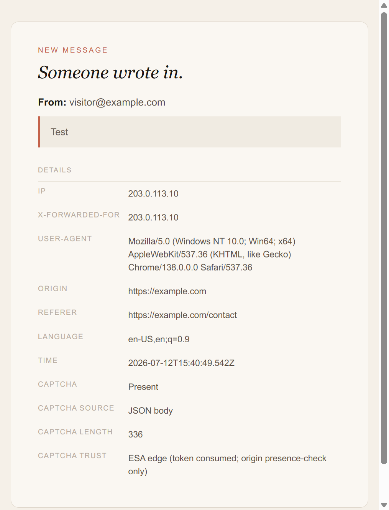
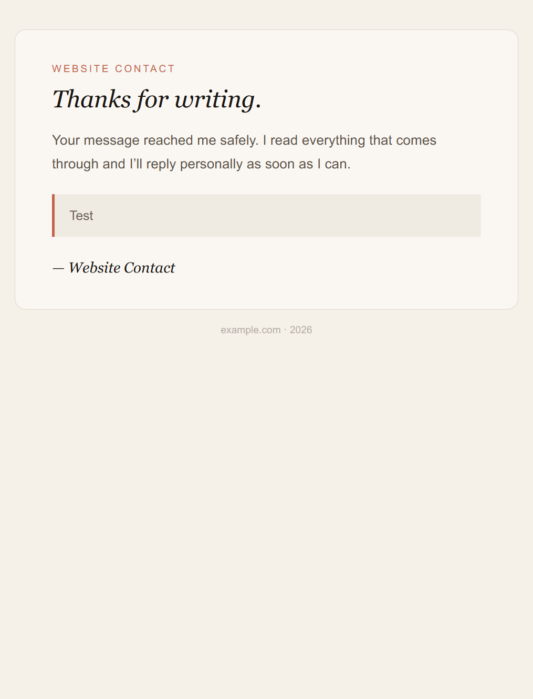

# ESA Contact Mailer

<p align="center">
  <strong>轻量 Express 联系表单邮件后端</strong><br/>
  SMTP 通知 + 自动回复 · 限流 · 蜜罐 · 可选阿里云 ESA AI 验证码
</p>

<p align="center">
  <a href="https://github.com/JonathanLye/esa-contact-mailer/blob/main/LICENSE"></a>
  <a href="https://nodejs.org/">= 18" /></a>
  <a href="https://github.com/JonathanLye/esa-contact-mailer/actions/workflows/ci.yml"></a>
  <a href="https://github.com/JonathanLye/esa-contact-mailer/issues"></a>
</p>

<p align="center">
  <strong>Languages:</strong> <a href="README.md">English</a> · <a href="README.zh-CN.md">简体中文</a>
</p>

---

## 简介

`esa-contact-mailer` 是一个单进程联系表单后端：

1. 接收 `POST /api/contact`，请求体为 `{ email, message }`
2. 通过 SMTP 给你发业主通知邮件
3. 给访客发送礼貌的自动回复
4. 自带限流、CORS 白名单和蜜罐字段

它针对 **阿里云 ESA AI 验证码** 做了适配（把 ESA 放在 `/api/contact` 前面时），但这一层是**可选的**。验证码相关环境变量留空时，服务就是普通的 SMTP 发信后端。

---

## 预览

默认 HTML 邮件模板效果（展示名 / 站点名由 `FROM_DISPLAY_NAME`、`SITE_NAME` 配置）：

| 业主通知 | 访客自动回复 |
| --- | --- |
|  |  |

---

## 特性

- **SMTP 转发** — 默认 QQ 邮箱；可改 host/port 适配 Gmail、Outlook 或自建 SMTP
- **业主通知 + 访客自动回复** — HTML + 纯文本模板
- **基础防滥用** — CORS 白名单、15 分钟内最多 5 次、蜜罐字段 `website`
- **可选反向代理密钥** — `X-Contact-Proxy-Token`，只有你的 nginx 路径能发信
- **可选阿里云 ESA AI 验证码** — 边缘验票；源站做存在性检查（代码里用注释块标清，可软禁用或硬删除）

---

## 快速开始

```bash
git clone https://github.com/JonathanLye/esa-contact-mailer.git
cd esa-contact-mailer
npm install
cp .env.example .env
# 编辑 .env — 至少填写 SMTP_USER / SMTP_PASS / CONTACT_TO / ALLOWED_ORIGIN
npm start
```

健康检查：

```bash
curl http://127.0.0.1:8787/api/health
```

发送测试消息：

```bash
curl -X POST http://127.0.0.1:8787/api/contact \
  -H "Content-Type: application/json" \
  -H "Origin: http://localhost:5173" \
  -d '{"email":"you@example.com","message":"Hello from curl"}'
```

把前端联系表单指向 `/api/contact`（或用 Vite / nginx 把该路径代理到 `http://127.0.0.1:8787`）。

---

## 配置

复制 `.env.example` → `.env`。

| 变量 | 必填 | 默认值 | 用途 |
|------|------|--------|------|
| `SMTP_USER` | 是 | — | SMTP 用户名 / 邮箱 |
| `SMTP_PASS` | 是 | — | SMTP 密码或授权码 |
| `CONTACT_TO` | 否 | `SMTP_USER` | 业主通知收件箱 |
| `SMTP_HOST` | 否 | `smtp.qq.com` | SMTP 主机 |
| `SMTP_PORT` | 否 | `465` | SMTP 端口 |
| `SMTP_SECURE` | 否 | `true` | TLS（STARTTLS 场景可设 `false`） |
| `PORT` | 否 | `8787` | 监听端口（绑定 `127.0.0.1`） |
| `ALLOWED_ORIGIN` | 否 | `http://localhost:5173` | CORS 白名单，逗号分隔 |
| `FROM_DISPLAY_NAME` | 否 | `Website Contact` | 邮件模板中的发件展示名 |
| `SITE_NAME` | 否 | 第一个 `ALLOWED_ORIGIN` 的主机名 | 邮件脚标品牌 |
| `CONTACT_PROXY_TOKEN` | 否 | _(空)_ | 与反向代理共享的密钥 |
| `CAPTCHA_SCENE_ID` | 否 | _(空)_ | 阿里云 ESA 验证码场景 ID |
| `CAPTCHA_REGION` | 否 | `cn` | `cn` 或 `sgp` |
| `ALIYUN_ACCESS_KEY_ID` | 否 | _(空)_ | 验证码门控用的 RAM AccessKey |
| `ALIYUN_ACCESS_KEY_SECRET` | 否 | _(空)_ | RAM AccessKey 密钥 |

**QQ 邮箱**：在邮箱设置里开启 SMTP，并创建**授权码**（不要用登录密码）。

---

## 可选：阿里云 ESA AI 验证码

本项目设计为在生产环境坐落在 **阿里云 ESA AI 验证码**（一点即过）之后。

### 纵深防御

1. **ESA 边缘**在流量到达源站前完成挑战校验
2. **本源站**在验证码环境变量已配置时，只检查 verify 参数是否存在（边缘已消费 V3 token；再调 OpenAPI 会返回 F018 复用错误）
3. **Nginx**（或任意反向代理）可发送与 `CONTACT_PROXY_TOKEN` 一致的 `X-Contact-Proxy-Token`，避免客户端直连 Node 端口

### 软禁用（本地 / 非 ESA 场景推荐）

在 `.env` 中留空：

```bash
ALIYUN_ACCESS_KEY_ID=
ALIYUN_ACCESS_KEY_SECRET=
CAPTCHA_SCENE_ID=
```

此时 `captchaConfigured` 为 `false`，所有验证码分支都是空操作。

### 硬删除

1. 删除 `index.js` 中所有夹在以下标记之间的代码块：
   ```
   // ===== BEGIN Aliyun ESA AI Captcha (optional) =====
   ...
   // ===== END Aliyun ESA AI Captcha =====
   ```
   （`captchaRows` 默认为 `''`，删除后业主通知 HTML 仍然有效。）
2. 卸载 SDK：
   ```bash
   npm uninstall @alicloud/captcha20230305 @alicloud/openapi-core
   ```
3. 若 fork 本仓库，可同时删掉 `.env.example` 里的验证码段落

`CONTACT_PROXY_TOKEN` **不属于** ESA 模块——它是通用的反向代理共享密钥，没有阿里云也能继续用。

### 前端说明

启用验证码时，浏览器应传递 ESA verify 参数，方式为：

- JSON 字段 `captcha_verify_param`，或
- 请求头 `captcha-verify-param`

---

## 部署说明

1. 进程只绑定 `127.0.0.1`（`index.js` 已默认如此）
2. 将 `/api/contact` 反向代理到 `http://127.0.0.1:8787`
3. 可选：设置 `CONTACT_PROXY_TOKEN`，并在 nginx 注入：
   ```nginx
   proxy_set_header X-Contact-Proxy-Token "your-long-random-secret";
   ```
4. 防火墙禁止公网访问 Node 端口
5. 将 `ALLOWED_ORIGIN` 设为真实站点 origin

`pm2`、`systemd`、Docker 均可；本仓库故意不绑定特定进程管理器。

---

## API

### `GET /api/health`

```json
{ "ok": true }
```

### `POST /api/contact`

请求体：

```json
{
  "email": "visitor@example.com",
  "message": "Hello",
  "website": ""
}
```

`website` 是蜜罐字段——真实表单请留空。机器人填了它会安静返回 `{ "ok": true }`，但不会发信。

成功：`{ "ok": true }`  
失败：`{ "ok": false, "error": "…" }`，状态码可能为 `400` / `403` / `429` / `500` / `503`

---

## 贡献

见 [CONTRIBUTING.md](CONTRIBUTING.md)。欢迎提 bug 与小范围 PR。

---

## 许可证

[MIT](LICENSE) © JonathanLye
